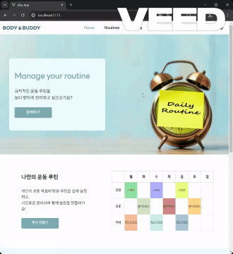
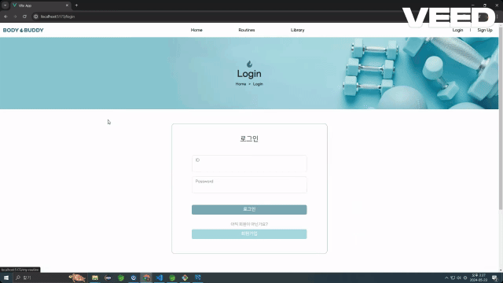
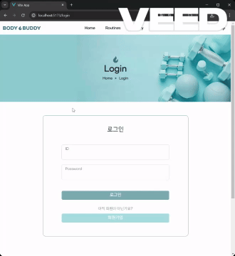

# 운동 루틴 관리 서비스 BodyBuddy

<br>

## 프로젝트 소개

- BodyBuddy는 내 루틴을 등록하고 이를 공유할 수 있습니다.
- 내 루틴을 등록하면 자동으로 루틴 게시판에 업로드되는데 루틴 게시판에서 다른 유저들의 루틴을 찜하거나 내 루틴에 추가할 수 있습니다.
- 다른 유저의 게시글에 댓글을 작성할 수 있습니다.

<br>

## 팀원 구성

<div align="center">

|                                                         **민예림**                                                          |                                                        **김재현**                                                        |
| :-------------------------------------------------------------------------------------------------------------------------: | :----------------------------------------------------------------------------------------------------------------------: |
| [ <br/> @yelim99](https://github.com/yelim99) | [ <br/> @KimJ4ehyun](https://github.com/KimJ4ehyun) |
</div>

<br>

## 1. 개발 환경

- Front : Vue.js, HTML, CSS, JavaScript
- Back-end : Spring Boot, Java
- DBMS : MySQL
- 버전 및 이슈관리 : Github
- 협업 툴 : Github, Notion, Discord
- 디자인 : Figma, BootStrap
<br>

## 2. 채택한 개발 기술과 브랜치 전략

### Vue.js

- 컴포넌트 기반 아키텍처인 Vue.js를 사용하여 코드의 재사용성과 유지보수 용이성을 고려
- Single File Component를 통해서 코드 가독성을 높였고, 스코프 스타일을 사용하여 css를 컴포넌트 별로 구분
- Vue Router를 이용하여 동적 라우트 매칭, Navigation Guard를 이용하여 사용자 인증 및 권한 검사
    
### Spring Boot, Java

- Spring Boot를 사용하여 RESTful한 웹 서비스를 개발
- Swagger를 이용한 테스트 용이성
- MyBatis와의 원활한 통합

### 브랜치 전략

- master 브랜치와 개별 브랜치로 나누어서 개발
- 개별 브랜치에서 개발한 후 master 브랜치에 merge
- 충돌 가능성이 있는 파일을 수정할 때는 주석으로 수정한 부분 처음과 끝 명시
- Commit Message 규칙을 통해서 무엇을 했는지 명시

<br>

## 3. 프로젝트 구조

```
📂 BodyBuddy
ㄴ 📂 Back
   ㄴ 📂 BodyBuddyProject
      ㄴ 📂 .mvn
      ㄴ 📂 .settings
      ㄴ 📂 bin
      ㄴ 📂 src
         ㄴ 📂 main
            ㄴ 📂 java
               ㄴ 📂 com.boddybuddy.fit
                  ㄴ 📂 config
                     ㄴ 📄 DBConfig.java
                     ㄴ 📄 SwaggerConfig.java
                     ㄴ 📄 WebConfig.java
                  ㄴ 📂 controller
                     ㄴ 📄 MyPageController.java
                     ㄴ 📄 RBoardController.java
                     ㄴ 📄 ReviewController.java
                     ㄴ 📄 UserController.java
                     ㄴ 📄 WishController.java
                  ㄴ 📂 interceptor
                     ㄴ 📄 LoginInterceptor.java
                  ㄴ 📂 model
                     ㄴ 📂 dao
                        ㄴ 📄 MyPageDao.java
                        ㄴ 📄 ReviewDao.java
                        ㄴ 📄 RoutineDao.java
                        ㄴ 📄 UserDao.java
                        ㄴ 📄 WishDao.java
                     ㄴ 📂 dto
                        ㄴ 📄 Exercise.java
                        ㄴ 📄 Review.java
                        ㄴ 📄 Routine.java
                        ㄴ 📄 User.java
                        ㄴ 📄 Wish.java
                     ㄴ 📂 service
                        ㄴ 📄 MyPageService.java
                        ㄴ 📄 MyPageServiceImpl.java
                        ㄴ 📄 ReviewService.java
                        ㄴ 📄 ReviewServiceImpl.java
                        ㄴ 📄 RoutineService.java
                        ㄴ 📄 RoutineServiceImpl.java
                        ㄴ 📄 UserService.java
                        ㄴ 📄 UserServiceImpl.java
                        ㄴ 📄 WishService.java
                        ㄴ 📄 WishServiceImpl.java
                  ㄴ 📄 BodyBuddyProjectApplication.java
            ㄴ 📂 resources
               ㄴ 📂 mappers
                  ㄴ 📄 myPageMapper.xml
                  ㄴ 📄 reviewMapper.xml
                  ㄴ 📄 routineMapper.xml
                  ㄴ 📄 userMapper.xml
                  ㄴ 📄 wishMapper.xml
               ㄴ 📄 application.properties
               ㄴ 📄 boddybuddy.sql
               ㄴ 📄 dummy.sql
      ㄴ 📂 target
      ㄴ 📄 .classpath
      ㄴ 📄 .factorypath
      ㄴ 📄 .gitignore
      ㄴ 📄 .project
      ㄴ 📄 mvnw
      ㄴ 📄 mvnw.cmd
      ㄴ 📄 pom.xml
ㄴ 📂 Front
   ㄴ 📂 BodyBuddy
      ㄴ 📂 .vscode
      ㄴ 📂 node_modules
      ㄴ 📂 public
      ㄴ 📂 src 
         ㄴ 📂 assets
            ㄴ 📂 img
            ㄴ 📄 style.css
         ㄴ 📂 components
            ㄴ 📂 common
               ㄴ 📄 TheFooter.vue
               ㄴ 📄 TheHeader.vue
            ㄴ 📂 icons
            ㄴ 📂 main
               ㄴ 📄 carouselItem.vue
            ㄴ 📂 myPage
               ㄴ 📄 LikeList.vue
               ㄴ 📄 MyRoutine.vue
               ㄴ 📄 MyRoutineDetail.vue
               ㄴ 📄 MyRoutineRegist.vue
               ㄴ 📄 MyRoutineRegistDetail.vue
               ㄴ 📄 MyRoutineUpdate.vue
               ㄴ 📄 UserInfoEdit.vue
            ㄴ 📂 popup
               ㄴ 📄 PopupUserId.vue
               ㄴ 📄 PopupNickname.vue
            ㄴ 📂 review
               ㄴ 📄 reviewList.vue
               ㄴ 📄 reviewDetail.vue
            ㄴ 📂 routineBoard
               ㄴ 📄 addModal.vue
               ㄴ 📄 BoardDetail.vue
               ㄴ 📄 BoardList.vue
               ㄴ 📄 BoardListOne.vue
               ㄴ 📄 Modal.vue
               ㄴ 📄 TimeTable.vue
         ㄴ 📂 data
            ㄴ 📄 allExercises.js
            ㄴ 📄 exercises.js
         ㄴ 📂 router
            ㄴ 📄 index.js
         ㄴ 📂 stores
            ㄴ 📄 board.js
            ㄴ 📄 myPage.js
            ㄴ 📄 review.js
            ㄴ 📄 user.js
            ㄴ 📄 wish.js
         ㄴ 📂 views
            ㄴ 📄 HomeView.vue
            ㄴ 📄 JoinView.vue
            ㄴ 📄 LibraryView.vue
            ㄴ 📄 LoginView.vue
            ㄴ 📄 MyPageView.vue
            ㄴ 📄 RoutineBoardView.vue
         ㄴ 📄 App.vue
         ㄴ 📄 main.js
      ㄴ 📄 index.html
      ㄴ 📄 .gitignore
      ㄴ 📄 jsconfig.json
      ㄴ 📄 package.json
      ㄴ 📄 package-lock.json
      ㄴ 📄 README.md
      ㄴ 📄 vite.config.js
ㄴ 📂 Scrum
ㄴ 📄 .gitignore
ㄴ 📄 README.md    
    
```

<br>

## 4. 역할 분담

### 🍊민예림

- **UI**
    - 페이지 : 홈, 검색, 게시글 작성, 게시글 수정, 게시글 상세, 채팅방
    - 공통 컴포넌트 : 게시글 템플릿, 버튼
- **기능**
    - 유저 검색, 게시글 등록 및 수정, 게시글 상세 확인, 댓글 등록, 팔로워 게시글 불러오기, 좋아요 기능

<br>
    
### 🐝김재현

- **UI**
    - 페이지 : 프로필 설정, 프로필 수정, 팔로잉&팔로워 리스트, 상품 등록, 상품 수정, 채팅 목록, 404 페이지
    - 공통 컴포넌트 : 탭메뉴, InputBox, Alert 모달, 댓글
- **기능**
    - 프로필 설정 및 수정 페이지 유저 아이디 유효성 및 중복 검사, 상품 등록 및 수정

<br>


## 5. 개발 기간 및 작업 관리

### 개발 기간

- 전체 개발 기간 : 2024-04-24 ~ 2024-05-22
- 아이디어 회의 및 요구사항 분석 : 2024-04-24 ~ 2024-04-30
- DataBase 설계 : 2024-04-28 ~ 2024-04-30
- Figma 설계 : 2024-04-30 ~ 2024-05-06
- API 설계 : 2024-05-06 ~ 2024-05-09
- Back 구현 : 2024-05-09 ~ 2024-05-12
- Front 구현 : 2024-05-11 ~ 2024-05-22
- 테스트 : 2024-05-22 ~ 2024-05-22

<br>

### 작업 관리

- 오전 9시에 Daily Scrum 진행, 작업 상황 브리핑 및 코드 리뷰 후 PR
- 오후 6시에 Daily Wrap Up 진행, 어떤 작업을 했고, 다음에 뭘 해야되는지 확인

<br>

## 6. 페이지별 기능

### [홈]
  - 로그인이 되어 있지 않은 경우 : 로그인, 회원가입 문구
  - 로그인이 되어 있는 경우 : nickname 님, 로그아웃 문구

| 초기화면 |
|----------|
||

<br>

### [회원가입]
- 모든 항목에 대해서 입력창에서 바로 유효성 검사가 진행되고 통과하지 못한 경우 각 경고 문구가 입력창 하단에 표시, 통과한 경우에는 초록색 문구로 표시
- 중복 확인을 누르면 ID 또는 Nickname에 대한 유효성 검사 및 중복 확인을 실행, 중복이 아닌 ID 또는 Nickname인 경우에 사용하기 버튼이 생성되고 해당 버튼을 누를 시에 해당 란에 사용한다고 한 ID 또는 Nickname이 그대로 들어감
- 모든 유효성 검사 통과 시에 가입하기 버튼이 활성화
- 가입하기 버튼을 누르면 회원 가입 alert창 생성

| 회원가입 |
|----------|
||

<br>

### [로그인]
- ID 또는 Password가 일치하지 않을 시에 경고 문구 생성
- 일치할 시에 홈화면으로 이동

| 로그인 |
|----------|
||

<br>

### [로그아웃]
- 우상단의 로그아웃 버튼을 누르면 홈화면으로 이동, pinia와 Front, Back session에 저장되어있는 유저 정보를 삭제

| 로그아웃 |
|----------|
||

<br>

### [루틴 게시판]
- 유저가 작성한 루틴들을 시간표 형태로 최신순으로 게시
- 해당 루틴을 누르면 루틴 상세 페이지로 이동
- 해당 운동을 누르면 모달로 운동의 상세 정보를 표시
- 하트 버튼을 통한 찜하기 기능 구현
- 찜한 루틴은 찜 목록에서 확인 가능
- 페이징을 통한 페이지 이동

| 루틴 게시판 |
|----------|
||

<br>

### [루틴 상세 페이지]
- 해당 운동을 누르면 모달로 운동의 상세 정보를 표시
- 하트 버튼을 통한 찜하기 기능 구현
- 내 루틴에 추가 버튼을 누르면 내 루틴에 추가(제목, 설명 작성 가능)
- 로그인 시에 리뷰 작성 및 내 리뷰에 대한 수정 및 삭제 가능

| 루틴 상세 페이지 |
|----------|
||

<br>

### [운동 라이브러리]
- 운동 목록에서 운동 검색 가능 

| 운동 라이브러리 |
|----------|
||

<br>

### [마이페이지]

<br>

#### 1. 내 루틴 관리
- 내 루틴 목록에 대한 관리
- 루틴에 대한 등록, 수정, 삭제

| 내 루틴 관리 |
|----------|----------|
||

<br>

#### 1-1. 루틴 등록하기
- 운동 부위를 선택 후 해당 운동을 체크하면 운동에 대한 상세정보 설정 가능(세트 수, 무게, 횟수, 요일, 시간)
- 선택한 운동에 대한 요일과 시간을 모두 선택했을 때 제목과 설명을 입력할 수 있는 창 생성
- 제목과 설명은 생략가능하며 제목은 없을 시에 '제목 없음' 으로 생성

| 루틴 등록하기 |
|----------|
||

<br>

#### 1-2. 루틴 수정하기
- 기존의 내용이 모두 생성된 상태로 시작
- 운동을 선택하고, 옵션들을 골라주면 루틴 수정

| 루틴 수정하기 |
|----------|
||

<br>

#### 1-3. 루틴 삭제하기
- 선택한 루틴을 삭제

| 루틴 삭제하기 |
|----------|
||

<br>

#### 2. 찜 목록
- 찜한 루틴을 확인
- 내 루틴에 추가 가능

| 찜 목록 |
|----------|
||

<br>

#### 3. 회원 정보 수정
- 현재 ID는 바꿀 수 없고, 자동으로 ID창에 입력
- 나머지 항목에 대해서는 로그인 창과 동일

| 회원 정보 수정 |
|----------|
||

<br>

## 7. 프로젝트 후기

### 🍊 민예림

깃헙을 통한 협업에 익숙해지는 것, 서로 감정 상하지 않고 무사히 마무리하는 것이 1차적인 목표였어서 항상 이 부분을 명심하면서 작업했습니다.
각자 페이지를 작업하고 합치는 과정에서 마주친 버그들이 몇 있었는데, 시간에 쫓기느라 해결하기에 급급해서 제대로 트러블슈팅 과정을 기록하지 못한 게 살짝 아쉬운 부분으로 남습니다. 그래도 2022년 한 해 동안 가장 치열하게 살았던 한 달인 것 같습니다. 조원들 모두에게 고생했다고 전하고 싶습니다🧡

<br>

### 👻 김재현

여러모로 많은 것들을 배울 수 있었던 한 달이었습니다. 혼자서는 할 수 없었던 일이라는 것을 너무 잘 알기에 팀원들에게 정말 감사하다는 말 전하고 싶습니다. 개인적으로 아쉬웠던 부분은 기한 내에 기능을 구현하는 데에만 집중하면서 트러블 슈팅이나 새로 배웠던 것들을 체계적으로 기록하지 못했다는 점입니다. 이렇게 느낀 바가 있으니 이후의 제가 잘 정리하면서 개발할 거라 믿습니다… 하하 다들 수고하셨습니다!!!!

<br>